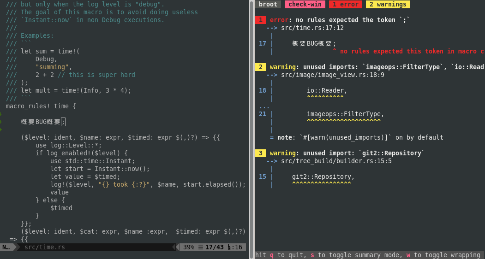
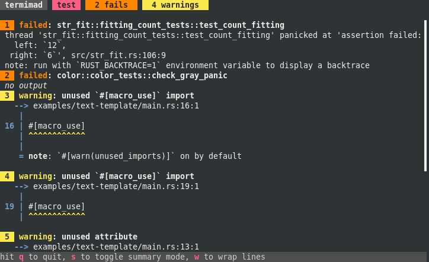

![bacon][logo]

[logo]: img/logo-text.png?raw=true "bacon"

[![Latest Version][s1]][l1] [![Chat on Miaou][s2]][l2]

[s1]: https://img.shields.io/crates/v/bacon.svg
[l1]: https://crates.io/crates/bacon

[s2]: https://miaou.dystroy.org/static/shields/room.svg
[l2]: https://miaou.dystroy.org/3768?rust


**bacon** is a background rust code checker.

It's designed for minimal interaction so that you can just let it running, side to your editor, and be notified of warnings and errors in your Rust code.



## Installation

```default
    cargo install bacon
```

## Usage

You launch `bacon` in a terminal you keep visible.

### check the current project

    bacon

### check another project

    bacon --path ../broot

or

    bacon ../broot

### run clippy instead of cargo check

    bacon --job clippy

or

    bacon clippy

### run tests

    bacon test



### define your own jobs

First create a `bacon.toml` file by running

    bacon --init

This file already contains some standard jobs. Add your own, for example

```toml
[jobs.check-win]
command = ["cargo", "check", "--target", "x86_64-pc-windows-gnu", "--color", "always"]
```

*Don't forget the `--color always` part: bacon uses style information to recognize warnings and errors.*

and run

    bacon check-win

### configure clippy lints

You can change the clippy job in the `bacon.toml` file:

```toml
[jobs.clippy]
command = [
	"cargo", "clippy",
	"--color", "always",
	"--",
	"-A", "clippy::match_like_matches_macro",
	"-A", "clippy::collapsible_if",
	"-A", "clippy::module_inception",
]
need_stdout = false
```

## FAQ

### What does it exactly do ?

It watches the content of your source directories and launches `cargo check` or other commands on changes.

Watching and computations are done on background threads to prevent any blocking.

The screen isn't cleaned until the compilation is finished to prevent useful information from being replaced by the lines of an unfinished computation.

Errors are displayed before warnings because you usually want to fix them first.

Rendering is adapted to the dimensions of the terminal to ensure you get a proper usable report. And bacon manages rewrapping on resize.

### Can I run several bacon in parallel ?

It's perfectly OK and can be useful to check several compilation targets.

Similarly you don't have to stop bacon when you want to use cargo to build the application.

Bacon is efficient and doesn't work when there's no notification.

### What are the supported platforms ?

It works on all decent terminals on Linux, Max OSX and Windows.

### Are there settings ?

Yes, they let you enable vim-like key bindings, or always start in summary mode or with lines wrapped.

To create a default preferences file, use `bacon --prefs`.

Shortcut:

    $EDITOR $(bacon --prefs)

### Why is bacon sometimes not recomputing when I'm using (neo)vim ?

The default write strategy of vim makes successive savings of the same file not always detectable by inotify.

A solution is to add this to your init.vim file:

	set nowritebackup

This doesn't prevent vim from keeping copies during editions, it just changes the behavior of the write operation.

### Why "bacon" ?

* It's a **bac**kground **con**piler.
* It comes from France and, as you know, France is bacon.

## Licences

Bacon is licenced under [AGPL-3.0](https://www.gnu.org/licenses/agpl-3.0.en.html).

The logo is designed by [Peter Varo][pv] and licensed under a
[Creative Commons Attribution-ShareAlike 4.0 International License][cc-lic].

[![license][cc-img]][cc-lic]

[pv]: https://petervaro.com
[cc-lic]: https://creativecommons.org/licenses/by-sa/4.0
[cc-img]: https://i.creativecommons.org/l/by-sa/4.0/80x15.png
